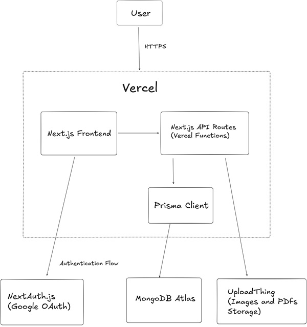

# scaler lite

A full-stack online learning platform built with Next.js. This was an assignment speedrun, built in around 50 hours.

----- 
### Deployed on Vercel. 

[scaler-lite.vercel.app](https://scaler-lite.vercel.app)

-----

## Stack

  - **Framework**: Next.js (App Router)
  - **Language**: TypeScript
  - **Database**: MongoDB
  - **ORM**: Prisma
  - **Auth**: NextAuth.js
  - **UI**: Tailwind CSS, shadcn/ui
  - **File Uploads**: UploadThing

-----


## Project Structure

### DB Schema (`schema.prisma`)

  * `User` - User information (Student or Instructor).
  * `Course` - course created by an instructor
  * `Lecture` lecture within a course (reading or quiz). Reading addtionally has 4 types - text, pdf, video (yt link), link
  * `Progress` - student's completion of lectures
  * `Score` - student's quiz scores
  * `Enrollment` - relationship - student's enrollment in a course
  
  

### API Routes (`/src/app/api`)

  * `/auth/...` - NextAuth.js routes for authentication.
  * `/courses` - GET all courses, POST new course.
  * `/courses/my-courses` - GET courses for the current user.
  * `/courses/[courseId]` - GET course details.
  * `/courses/[courseId]/enroll` - POST to enroll in a course.
  * `/courses/[courseId]/lectures/[lectureId]` - GET lecture details.
  * `/courses/[courseId]/lectures/[lectureId]/complete` - POST to mark a lecture as complete.
  * `/courses/[courseId]/lectures/[lectureId]/submit` - POST quiz submission.
  * `/profile` - POST to update user profile.
  * `/uploadthing` - Handles file uploads.
  * `/db-seed` - GET to populate database with initial data. (doesnt work in prod, remove else condition first for dev setup)

### Frontend Routes (`/src/app`)

  * `/` - home page
  * `/auth/sign-in` - sign-in page
  * `/courses` - all courses page
  * `/courses/[courseId]` - course detail page
  * `/courses/[courseId]/lectures/[lectureId]` - lecture view page
  * `/instructor/courses/create` - course creation form
  * `/profile/complete` - user profile completion page

-----

## Local Development

#### 1\. Clone & Install

```bash
git clone https://github.com/janardannn/scaler-lite.git
cd scaler-lite
npm i
```

#### 2\. Environment Variables

Create a `.env` file in the root directory and add the following:

```env
# Prisma
DATABASE_URL="your_mongodb_connection_string"

# NextAuth.js
NEXTAUTH_SECRET="a_random_secret_string_32_chars"  # npx auth secret
GOOGLE_CLIENT_ID="your_google_client_id"  # google cloud console > credentials > oauth
GOOGLE_CLIENT_SECRET="your_google_client_secret"

# UploadThing
UPLOADTHING_TOKEN="your_uploadthing_token"
```

#### 3\. Database Setup

Push the schema and generate the client.

```bash
npx prisma generate
npx prisma db push
```

#### 4\. Run Server

```bash
npm run dev
```

The app will be available at [http://localhost:3000](http://localhost:3000)

-----

## High Level Design


